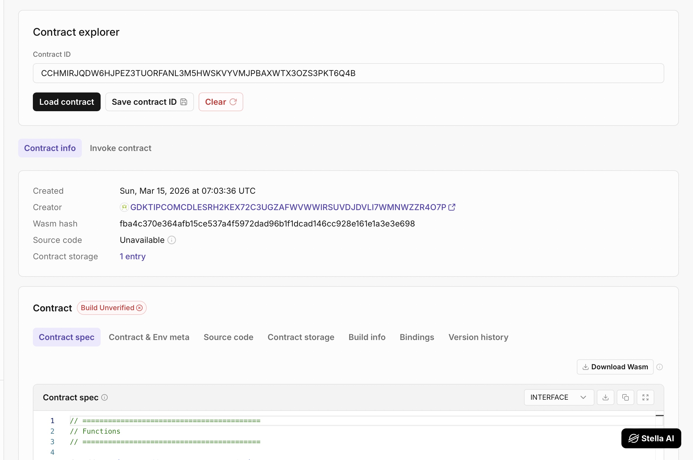

# 📝 NoteKeeper — Soroban Smart Contract

## Project Description

**NoteKeeper** is a simple decentralized note storage smart contract built using **Soroban on the Stellar blockchain**.
The project demonstrates how users can store and retrieve notes directly on-chain using Soroban smart contracts written in Rust.

Each note is linked to the wallet address that created it, ensuring that only authenticated users can add notes.

This project serves as a basic example for learning:

* Soroban smart contract development
* Blockchain-based storage
* Authentication with Stellar addresses
* Rust-based smart contract design

---



## What It Does

The **NoteKeeper** smart contract allows users to store short notes permanently on the blockchain.

Users can:

1. Add new notes
2. Store notes securely on-chain
3. Retrieve all stored notes from the contract
4. Edit notes
5. Delete notes

Productivity:

1. Pin important notes
2. Real-time search
3. Tag system (#ideas, #diary)

Themes & Backgrounds

1. Dreamy Night Mode
2. Soft Day Mode
3. Cloud mode
4. Starry night mode
5. Lo-fi animated mode
The contract uses Soroban’s instance storage to persist data across transactions.

---

## Features

### 🔐 User Authentication

Only authenticated wallet addresses can add notes using Soroban’s `require_auth()` security mechanism.

### 📝 On-Chain Note Storage

Notes are stored directly in the smart contract storage on the Stellar blockchain.

### 📦 Structured Data

Each note is stored using a structured data type containing:

* Owner address
* Note content

### ⚡ Lightweight & Efficient

The contract is minimal and optimized for Soroban's execution environment.

### 🧱 Rust + Soroban SDK

Built using Rust and the Soroban SDK for secure and efficient smart contract execution.

---

## Smart Contract Functions

### `add_note`

Adds a new note to the blockchain.

**Parameters**

* `user: Address` → Wallet address of the user creating the note
* `content: String` → The note text

**Behavior**

* Verifies the user's authorization
* Creates a new note
* Stores the note in contract storage

---

### `get_notes`

Returns all notes stored in the contract.

**Returns**

* `Vec<Note>` containing all stored notes

Each note contains:

```
owner: Address
content: String
```

---

## Project Structure

```
notekeeper/
│
├── src/
│   └── lib.rs        # Soroban smart contract
│
├── Cargo.toml        # Rust dependencies
│
└── README.md         # Project documentation
```

---

## Tech Stack

* **Stellar Soroban**
* **Rust**
* **Soroban SDK**
* **WebAssembly (WASM)**

---

## Build the Contract

```
stellar contract build
```

---

## Deploy the Contract

```
stellar contract deploy \
--wasm target/wasm32-unknown-unknown/release/notekeeper.wasm \
--source <ACCOUNT_NAME> \
--network testnet
```

---

## Example Contract Invocation

Add a note:

```
stellar contract invoke \
--id <CONTRACT_ID> \
--source <ACCOUNT_NAME> \
--network testnet \
-- add_note \
--user <WALLET_ADDRESS> \
--content "Hello Soroban"
```

Retrieve notes:

```
stellar contract invoke \
--id <CONTRACT_ID> \
--source <ACCOUNT_NAME> \
--network testnet \
-- get_notes
```

---

## Deployed Smart Contract Link

```
https://lab.stellar.org/r/testnet/contract/CCHMIRJQDW6HJPEZ3TUORFANL3M5HWSKVYVMJPBAXWTX3OZS3PKT6Q4B
```

Replace this with your deployed contract explorer link.


---

## Future Improvements

Possible enhancements for the project:

* Encrypted notes
* Collaborative notes
* Mobile optimization
* NFT-based notes


---

## License

MIT License
